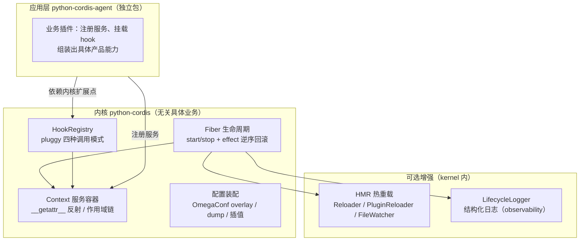

# python-cordis

A plugin-driven framework kernel for Python, inspired by the cordis framework:
**everything is a plugin**.

This package is a *meta-framework*: it ships only the engine that makes an
application composable from plugins — hooks, a reflective service container,
plugin lifecycle, config assembly, and hot reload. It knows nothing about
agents, LLMs, filesystems, persistence, or transports.

Concrete business modules (agent loop, session logs, persistence backends,
capability seams, web transport) live in the companion package
[`python-cordis-agent`](../python-cordis-agent/README.md) as plain, replaceable
plugins on top of this kernel.

## What the kernel provides

- `HookRegistry` (`python_cordis.core.hook`): plugin registration/discovery and
  the four hook invocation modes (`emit` / `parallel` / `bail` / `waterfall`)
  built on `pluggy`.
- `Context` (`python_cordis.core.context`): a reflective service container
  (`ctx.fs` resolves to a registered service), with `extend()` / `isolate()`
  scopes and reversible `register()`.
- `Fiber` (`python_cordis.core.fiber`): plugin instance lifecycle —
  `start()` / `stop()` with effects torn down in reverse registration order.
  When constructed with a `HookRegistry` that has the lifecycle specs
  registered, it emits `fiber_started` / `fiber_stopped`.
- Config assembly (`python_cordis.core.config`): OmegaConf-based loading,
  overlay patching, dumping, and interpolation (no arbitrary code execution).
- HMR (`python_cordis.core.hmr`): hot module reload without restarting.
  `Reloader` swaps a unit ("stop old, then start new") and rolls back on any
  failure; `PluginReloader` re-executes an already-imported plugin module in
  place and re-registers its hooks; `FileWatcher` (optional `watchdog`) fires
  `on_change` on any watched file.
- Lifecycle observability (`python_cordis.observability`):
  `setup_lifecycle_logging` registers the lifecycle hookspecs plus a
  `LifecycleLogger` plugin that writes structured records (`event`, `fiber`)
  via the standard `logging` module. It returns a disposer, so the
  observability is fully reversible.

The kernel declares no entry-point plugins of its own; applications register
their own plugins under the `python_cordis.plugins` group and load them with
`HookRegistry.load_entry_points()`.

## Quick start

```bash
pip install -e .
pytest
```

## Architecture



Key ideas:

- **Hooks are the seams between kernel and plugins** — the kernel declares what
  can be extended (`@hookspec`), plugins provide it (`@hookimpl`). Nothing in
  the kernel hard-codes a specific plugin.
- **`Fiber` emits, plugins observe** — the kernel only *emits* lifecycle
  events; logging is a plain, reversible plugin (`LifecycleLogger`).
- **Everything is replaceable** — the kernel owns no concrete provider; every
  business service is registered by an application-layer plugin, so swapping
  implementations needs zero kernel changes.

## Development

```bash
pip install -e ".[dev,hmr]"
python -m mypy        # strict type checking
python -m pytest      # test suite
python -m build       # sdist + wheel
```

The full feature specification (kernel + application layer, with package
ownership per feature) is maintained in the `deepseek-harness` repository at
`docs/python-cordis-feature-spec.md`.
