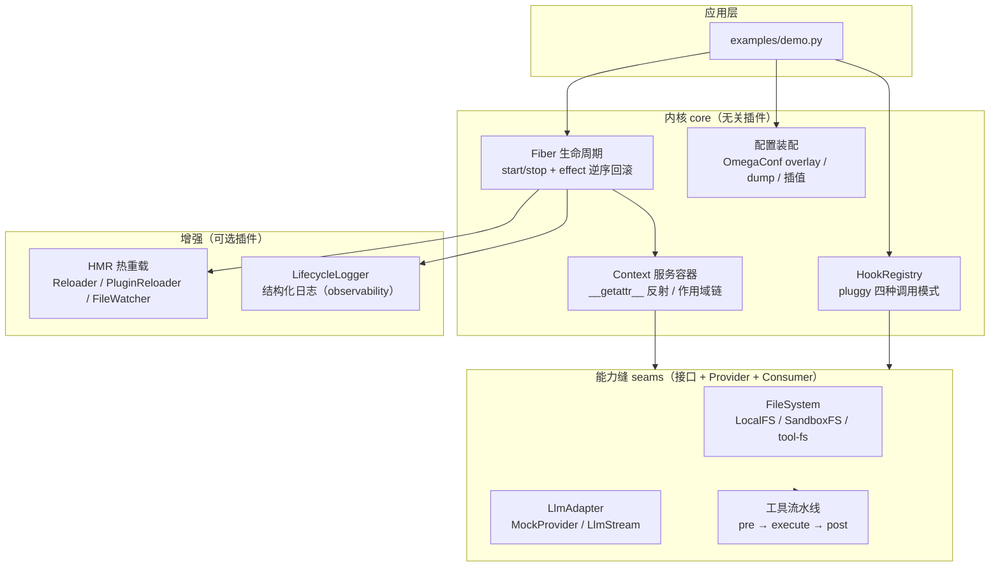

# python-cordis

A plugin-driven framework kernel for Python, inspired by the cordis framework:
**everything is a plugin**.

This project delivers the "engine" — how to organize an application as plugins —
not the agent/product logic on top of it. See
`docs/python-cordis-feature-spec.md` for the full feature specification
(status: 0.1 draft).

**Status**: P0 MVP (F1/F2/F3/F4/F5/F7/F9) done and green. P1 complete:
`SandboxFS` (F5.3), the LLM seam (F6), and HMR hot reload (F8) are implemented
and tested. P2 complete: structured lifecycle logging (F10.1), strict `mypy`
(F10.2), README architecture docs (F11.1), and packaging with a real
entry-point example plugin (F11.2). P3 complete: the agent main loop (F12),
event-sourced session log (F13), persistence backends (F14), and session
query (F15) are implemented and tested. F16 (transport/frontend) is implemented
as a reference iteration: four-quadrant RPC messages, HTTP up-link + WebSocket
down-link, a reversible transport plugin, and a minimal browser frontend
(install with `pip install -e ".[web]"`, run `python examples/demo_web.py`).

## Quick start

```bash
pip install -e .
pytest
python examples/demo.py
```

The demo builds a plugin tree with the filesystem seam + approval middleware,
runs a "write → read → vetoed write → list" flow, and (new in P2) shows
structured lifecycle logging and the auto-discovered entry-point plugin.

The web demo (`python examples/demo_web.py`) starts the transport plugin: an
HTTP up-link (`/api/<method>`) plus a WebSocket down-link (`/ws`), and serves a
minimal browser frontend at `http://127.0.0.1:8765/` — send a message and watch
the agent's event stream render in real time. Send a message containing
"write a file" and a tool-approval card appears (F17): approve it and the
agent's `write_file` tool runs, its result lands in the session log, and the
loop refluxes it to drive the next model step.

## Architecture



Key ideas:

- **Hooks are the seams between kernel and plugins** — the kernel declares what
  can be extended (`@hookspec`), plugins provide it (`@hookimpl`). Nothing in
  the kernel hard-codes a specific plugin.
- **`Fiber` emits, plugins observe** — the kernel only *emits* lifecycle
  events; logging is a plain, reversible plugin (`LifecycleLogger`).
- **Everything is replaceable** — providers implement stable interfaces
  (`FileSystem`, `LlmAdapter`), so swapping `LocalFS → SandboxFS` needs zero
  consumer changes.

## Core concepts

- `HookRegistry`: plugin registration/discovery and four hook invocation modes
  (`emit` / `parallel` / `bail` / `waterfall`) built on `pluggy`.
- `Context`: a reflective service container (`ctx.fs` resolves to a registered
  service), with `extend()` / `isolate()` scopes and reversible `register()`.
- `Fiber`: plugin instance lifecycle — `start()` / `stop()` with effects torn
  down in reverse registration order. When constructed with a `HookRegistry`
  that has the lifecycle specs registered, it emits `fiber_started` /
  `fiber_stopped`.
- Config assembly (`python_cordis.core.config`): OmegaConf-based loading,
  overlay patching, dumping, and interpolation (no arbitrary code execution).
- Capability seams (`python_cordis.seams`): interface + provider + consumer
  triads (e.g. `FileSystem` / `LocalFS` / `SandboxFS` / `tool-fs`), plus the
  tool execution pipeline with `pre` → `execute` → `post` waterfalls.
- LLM seam (`python_cordis.seams.llm`): `LlmAdapter` interface with a
  normalized `start/text/usage/finish/failure` event protocol, a deterministic
  offline `MockProvider`, and `LlmStream` that routes requests/events through
  `llm_request` / `llm_event` waterfalls. Adapter exceptions are normalized
  into a single `failure` event, never leaked as a bare exception.
- HMR (`python_cordis.core.hmr`): hot module reload without restarting.
  `Reloader` swaps a unit ("stop old, then start new") and rolls back on any
  failure, keeping the old version alive and recording the reason in `errors`;
  `PluginReloader` re-executes an already-imported plugin module in place (via
  `python_cordis.core.hmr`'s cache-bypassing source reload) and re-registers
  its hooks; `FileWatcher` (optional `watchdog`) fires `on_change` on any
  watched file so a config or plugin edit takes effect live.
- Structured logging (`python_cordis.observability`): `setup_lifecycle_logging`
  registers the lifecycle hookspecs plus a `LifecycleLogger` plugin that writes
  structured records (`event`, `fiber`) via the standard `logging` module.
  It returns a disposer, so the observability is fully reversible.
- Entry-point plugins (`python_cordis.contrib.demo_plugin`): a real example
  plugin registered under the `python_cordis.plugins` group; after
  `pip install -e .`, `load_entry_points()` auto-discovers it.
- Transport (`python_cordis.contrib.web_server`, optional `[web]` extra):
  four-quadrant RPC messages (`client-request` / `server-response` /
  `server-request` / `client-response`) correlated by `rpc_id`; an
  `RpcRegistry` that statically distinguishes CALL / PUSH / ASK; an HTTP
  up-link on the standard library plus a WebSocket down-link on its own
  event-loop thread, bridged by a thread-safe `EventBus`; all wrapped in a
  reversible `WebServerPlugin` (entry point `web-server`). A reference browser
  client lives in `python_cordis.contrib.web_frontend`.

## Development

```bash
pip install -e ".[dev,hmr]"
python -m mypy        # strict type checking (F10.2)
python -m pytest      # test suite
python -m build       # sdist + wheel (F11.2)
```
